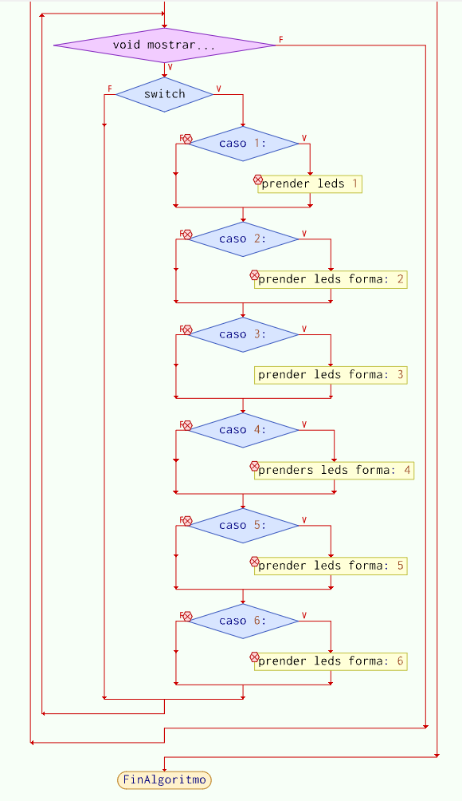

# TP2

## Dado electrónico. 

Utilizando un Arduino Nano (`atmega328p`), `6 ó 7 LEDs` y `3 Pulsadores` se pide:

1. Al presionar el `pulsador 1` se **encienden** los `LEDs` **barajando** las posibles respuestas
rápidamente.

2.  Al presionar el `pulsador 2` se **detiene** el cambio de los `LEDs`, **quedando encendidos**
aquellos que indican la "cara del dado que quedo hacia arriba". 

3. Una vez que se indica el `resultado`, se debe poder presionar el `pulsador 3 o 4` para
**apagar** los `LEDs` de manera de volver a la condición inicial.

> Nota: Todos los pulsadores `deben` tener habilitada la resistencia de `pull-up`

> Asi mismo los LEDs deben conectarse con su resistencia limitadora de corriente 2 asegurando no superar la corriente máxima que puede entregar el pin. Almenos de 330 Ohms.

## ¡USAR LOS PINES INDICADOS NO CAMBIARLOS!

``` C
PD4 -> BOTON 1 
PD5 -> BOTON 2 
PD6 -> BOTON 3 
PD7 -> BOTON 4

PD2 -> LED 1   
PD3 -> LED 2 
PB0 -> LED 3
PB1 -> LED 4 
PB2 -> LED 5 
PB3 -> LED 6
PB4 -> LED 7

```
## Pinout


## Circuito


# DIAGRAMA DE FLUJO PARTE 1 


# DIAGRAMA DE FLUJO PARTE 2 



# Informe 

<span style="color:gold">PRIMER PASO</span>

# Definir los Macros

(lo que hacen estos macros es definir un boton a cierto pin). 

``` C

#define boton1 ((PIND >> 4) & 0X01)
#define boton2 ((PIND >> 5) & 0X01)
#define boton3 ((PIND >> 6) & 0X01)
#define boton4 ((PIND >> 7 )& 0X01)

#define SET_PIN(PORT, PIN) (PORT |= (1 << PIN)) 
#define CLEAR_PIN(PORT, PIN) (PORT &= ~(1 << PIN)) 

```

<span style="color:gold">SEGUNDO PASO</span>

# Definir el contador (cont)

``` C 

char cont = 1;
char FLAG_BT1 = 0;

```


<span style="color:gold">TERCER PASO</span>

# Definir los pines de arduino y resistencias de pull up

Basicamente  lo que hacemos es es definir que led o que boton va a los pines del arduino; la resistencia de pull up sirven para cuando se quiere hacer el proyecto en la protoboard no utilicemos resistencias de mas y activar las que ya estan en el arduino.  

``` c

    DDRD &= ~(1<<PD4);										
    DDRD &= ~(1<<PD5);
    DDRD &= ~(1<<PD6);
    DDRD &= ~(1<<PD7);
    DDRD |= (1<<PD2); 
    DDRD |= (1<<PD3); 
    DDRB |= (1<<PB0); 
    DDRB |= (1<<PB1); 
    DDRB |= (1<<PB2); 
    DDRB |= (1<<PB3); 
    DDRB |= (1<<PB4); 
    PORTD|= (1<<PD4);
    PORTD|= (1<<PD5);
    PORTD|= (1<<PD6);
    PORTD|= (1<<PD7);

```
<span style="color:gold">CUARTO PASO</span>

# Definir el while 

lo que hacemos aqui es definir la accion de cada boton por ejemplo el boton 1 activa el logaritmo de la FLAG que va de 1 a 7. tambien colocamos el delay de la velosidad de como parpadea los leds. 
``` C 
while(1) 
    {
        if(boton1==0)
        { 
            FLAG_BT1=1;
        }
        if (FLAG_BT1==1)
        {
            cont++; 

            if (cont==7)
            {
                cont=1;
            }
       
            mostrar_led(cont);        
            _delay_ms(65);  

        }  
      
        if (boton2==0)         
       {
           FLAG_BT1=0;
       }
       if (boton3 == 0 || boton4 == 0)
       {
         CLEAR_PIN(PORTD,PD2);
         CLEAR_PIN(PORTD,PD3);
         CLEAR_PIN(PORTB,PB0);
         CLEAR_PIN(PORTB,PB1);        
         CLEAR_PIN(PORTB,PB2);
         CLEAR_PIN(PORTB,PB3);
         CLEAR_PIN(PORTB,PB4);

       }


         
    }   
}

```
<span style="color:gold">QUINTO Y ULTIMO PASO</span>

# Definimos el switch

Aqui lo que hacemos es "programar el algoritmo" para que nos muestre distinto numero alazar. 

``` C 
switch (num)
{
  
 case 1:  
        SET_PIN(PORTB,PB4); 

    break;


 case 2: 
         SET_PIN(PORTD,PD2);
         SET_PIN(PORTB,PB3); 

  break;

  case 3: 
         
        SET_PIN(PORTD,PD2);
        SET_PIN(PORTB,PB4);
        SET_PIN(PORTB,PB3);

    break;

    case 4:

         SET_PIN(PORTD,PD2); 
         SET_PIN(PORTB,PB0);
         SET_PIN(PORTB,PB1);
         SET_PIN(PORTB,PB3);

    break;

     case 5:

         SET_PIN(PORTD,PD2); 
         SET_PIN(PORTB,PB0);
         SET_PIN(PORTB,PB1);
         SET_PIN(PORTB,PB3);
         SET_PIN(PORTB,PB4);

    break;

     case 6:

         SET_PIN(PORTD,PD2); 
         SET_PIN(PORTD,PD3);
         SET_PIN(PORTB,PB0);
         SET_PIN(PORTB,PB1);
         SET_PIN(PORTB,PB2);
         SET_PIN(PORTB,PB3);
         SET_PIN(PORTB,PB4);

    break;

 }
}

```
